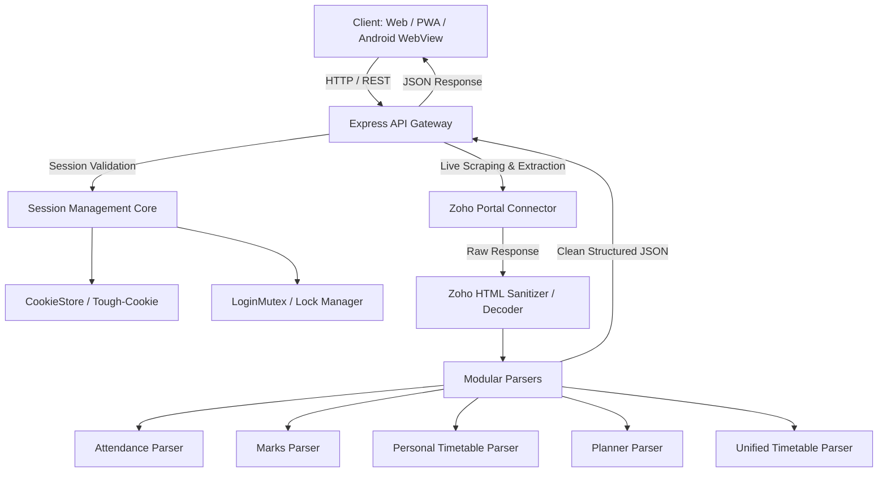

# 🎓 SRM Academia+

<div align="center">


### The Next-Gen Companion for SRM Institute of Science & Technology
**Automated Attendance Tracking • Intelligent Bunk Calculator • Live Timetable Matrix • Academic Planner • 32+ Premium Themes**

[](https://nodejs.org)
[](https://expressjs.com)
[](https://github.com)
[](LICENSE)
[](https://vercel.com)

</div>

---

## 🌟 Overview

**SRM Academia+** is a powerful, modern, and lightning-fast companion web & mobile application engineered for students at SRM Institute of Science & Technology (SRMIST). 

It connects directly with the official SRM Academia student portal, seamlessly parsing complex Zoho Creator dynamic interfaces to deliver a fluid, native-grade experience with real-time academic insights, predictive calculators, and rich customizable themes.

---

## ✨ Key Features

### 📊 1. Attendance Tracker & Smart Bunk Calculator
- **Real-Time Percentages**: Instant calculation of total attended vs. conducted hours across all enrolled theory and practical courses.
- **Dynamic Bunk/Catch-up Margin**: Know exactly how many classes you can afford to safely miss while staying above the mandatory **75% threshold**, or how many consecutive classes you must attend to recover.
- **Predictive "What-If" Simulation**: Run interactive simulations (e.g., *"What will my attendance be if I miss 3 classes next week?"*) without modifying actual data.
- **Threshold Visual Highlights**: Color-coded danger warnings (red for `<75%`, yellow for `75-80%`, green for `>85%`).

### 📅 2. Live Timetable Matrix & Day Order Engine
- **Live Day Order Calculation**: Automatically synchronizes with the official SRM Academic Calendar to pinpoint today’s Day Order (Day 1 – Day 5) and highlight active class periods.
- **Complete 12-Period Weekly Grid**: Full desktop & mobile matrix visualizing class schedules, room allocations, course codes, and faculty details.
- **High-Res Timetable Image Export**: One-click download of your complete weekly timetable with transparent high-resolution rendering.

### 📈 3. Performance Trends & Micro-Sparklines
- **Course Distribution Trend**: Sparkline visualization showing your attendance spread across the semester.
- **Internal Marks Progression**: Course-by-course internal assessment marks trend with estimated 10-point GPA scale projections.

### 🗓️ 4. Academic Calendar & Semester Planner
- **Interactive Calendar**: Full month-by-month academic planner displaying instructional days, cycle tests (CTs), semester exams, university holidays, and event schedules.
- **Personal Notes & Custom Events**: Attach custom study reminders and personal events directly to calendar dates.

### 🎨 5. 32+ Handcrafted Design Systems & Themes
- **Flagship Themes**: Clean Light (Default), Refractive Glassmorphism (Dark & Light), Neo-Brutalist Light, Claymorphism 3D, Retro Computing, OLED Clean Dark, Cyberpunk Neon, Dracula Dark, Synthwave 80s, Catppuccin Mocha, and more.
- **Instant Pre-Paint Hydration**: Zero layout reflow or theme flashing during hard reloads.

### 👥 6. Instant Multi-Account Switcher
- Switch between multiple student accounts with a single click — perfect for roommates, dual-degree students, or checking peer schedules.
- Encrypted local credential caching with independent session preservation.

### 📱 7. Android App & Home Screen Widget Support
- Native Android app container with bidirectional bridge (`AndroidWidgetBridge`).
- Dedicated home screen widgets displaying current day order, up next class, and live attendance metrics.

---

## 🛠️ Architecture & Tech Stack



### Technology Highlights
- **Backend Runtime**: Node.js (v18+) with Express 5
- **Scraping & HTML Parsing**: Axios, Cheerio, Tough-Cookie
- **Frontend Architecture**: Vanilla ES6+ JavaScript, CSS3 Design Tokens & Custom Properties, Chart.js for micro-sparklines
- **Mobile Container**: Android SDK with native WebView & App Widget Provider
- **Serverless Ready**: Fully compatible with Vercel Serverless Functions

---

## 🚀 Getting Started

### Prerequisites
- [Node.js](https://nodejs.org/) (version 18.x or higher)
- [npm](https://www.npmjs.com/) (version 9.x or higher)
- Valid SRM Academia student credentials

### 1. Clone the Repository
```bash
git clone https://github.com/satadru-bh/srm-academia.git
cd srm-companion
```

### 2. Install Dependencies
```bash
npm install
```

### 3. Start the Development Server
```bash
npm start
```
Open your browser and navigate to:
```
http://localhost:3000
```

---

## 🌐 API Reference

| Method | Endpoint | Description |
| :--- | :--- | :--- |
| `POST` | `/api/login` | Authenticates with SRM Academia portal and initializes persistent session |
| `ALL` | `/api/sync` | Fetches latest Attendance, Timetable, Academic Planner, and Marks data |
| `POST` | `/api/logout` | Terminates active session and clears associated cookie jars |
| `POST` | `/api/debug` | Diagnostics utility for testing parser outputs against raw payloads |

---

## ☁️ Deployment

### Deploying to Vercel
The project includes a ready-to-use [`vercel.json`](vercel.json) configuration:
1. Push your repository to GitHub.
2. Import the repository in your [Vercel Dashboard](https://vercel.com).
3. Set Framework Preset to **Other** (Output directory: `public`).
4. Click **Deploy**.

### Deploying with PM2 (VPS / Docker)
```bash
npm install -g pm2
pm2 start server.js --name "srm-academia"
pm2 save
pm2 startup
```

---

## 🔒 Security & Privacy

- **No Database Persistence of Passwords**: Student credentials and passwords are **never stored on external databases or third-party servers**.
- **Client-Side Storage**: Sensitive account tokens and user preferences reside exclusively inside the student's browser `localStorage` or device sandbox.
- **Direct Portal Communication**: Authentication requests are piped directly to the official SRM Institute of Science & Technology Academia endpoint via secure TLS connections.

---

## 🤝 Contributing

Contributions, issues, and feature requests are welcome!

1. Fork the project.
2. Create your Feature Branch (`git checkout -b feature/AmazingFeature`).
3. Commit your changes (`git commit -m 'feat: Add some AmazingFeature'`).
4. Push to the branch (`git push origin feature/AmazingFeature`).
5. Open a Pull Request.

---

## 📄 License

This project is licensed under the **ISC License**. See the [LICENSE](LICENSE) file for details.

<div align="center">
  <sub>Built with ❤️ for SRMites. Disclaimer: SRM Academia+ is an independent student utility and is not officially affiliated with or endorsed by SRM Institute of Science and Technology.</sub>
</div>
